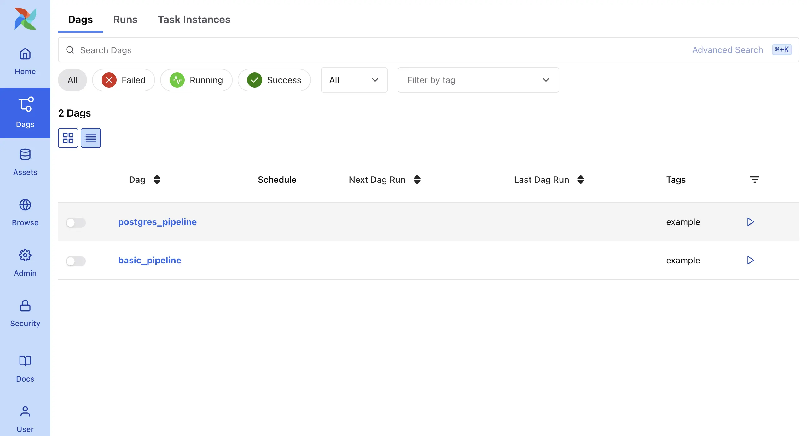

## Apache Airflow Example in Docker Compose
This example demonstrates **Apache Airflow 3** with **Python 3.12** running in **Docker Compose**.

## Usage
1. Ensure you have **Docker** installed on your system
2. Start the services by running `docker compose up` in your terminal
3. Access Airflow at http://localhost:8080 and sign in:
   - Username: **airflow**
   - Password: **airflow**

## Screenshot

